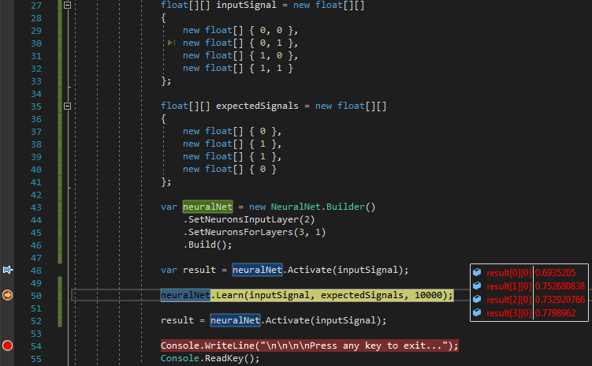
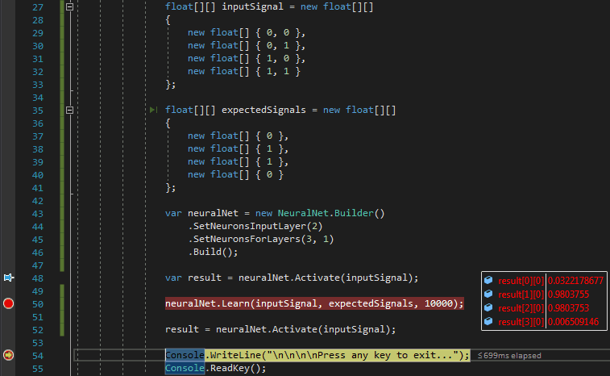

# Neural Network Library (DLL)

This is .NET library that implements functionality for creating and training neural networks ([multilayer perceptron](https://en.wikipedia.org/wiki/Multilayer_perceptron)). The library built from scratch using C# for educational purposes and is under development and expansion. Neural computing doesn't use GPU, only CPU. The library provides easy-to-use classes and methods (APIs) for creating new neural networks, training and using them. The following settings are currently available (via the APIs):

* Configuration of neural networks: the number of layers and neurons in each of them.
* Activation functions: Sigmoid, TanH, Identity, ReLU, Gaussian.
* Loss functions: MSE, Arctan, RootMSE.
* Method for initializing the neuron weights: Zeros, Ones, Random, XavierUniform.
* Method for initializing the bias neurons (output signal): Zeros, Ones, Random.
* Method for optimizing of training: Stochastic Gradient Descent with Momentum (SGDM).

## API

### NeuralNet.Builder Class ([fluent interface](https://en.wikipedia.org/wiki/Fluent_interface))

Provides methods for creating and initially configuring a neural network.

Methods               | Parameters                                                       | Description
:-------------------- | :--------------------------------------------------------------: |:------------
SetNeuronsInputLayer  | **uint** inputNeurons                                            | The number of neurons (sensors) for the input layer (don't have weights and don't participate in training). This setting determines the size of the input dataset. **Without this parameter, a neural network cannot be created**.
SetNeuronsForLayers   | **params uint[]** neuronLayers                                   | The numbers of neurons for the other layers. For example: `.SetNeuronsForLayers(5, 10, 4)` - 2 hidden layers (5 and 10 neurons) and output layer (4 neurons) will be created behind the input layer. **Without this parameter, a neural network cannot be created**.
SetWeightsInitializer | **enum InitializerWeights** weightsInitializer                   | Method for initializing the weight of neurons in all layers. For example: `.SetWeightsInitializer(InitializerWeights.XavierUniform)`. The default value is **InitializerWeights.Random**.
SetBiasNeurons        | **bool** isBiasNeurons, **enum InitializerBias** biasInitializer | The first parameter is responsible for using / not using bias. The second parameter is responsible for the method of initializing [bias neurons](https://en.wikipedia.org/wiki/Machine_learning#Bias). The default value is **false**.
SetActivationFunc     | **enum ActivationFunc** activationFunc                           | Initial setting of the [activation function](https://en.wikipedia.org/wiki/Activation_function). The default value is **ActivationFunc.Sigmoid**.
SetLearningOptimizing | **enum LearningOptimizing** learningOptimizing                   | Initial setting of the [optimization method](https://en.wikipedia.org/wiki/Stochastic_gradient_descent) for training neural networks. The default value is **LearningOptimizing.SGDM**.
SetLossFunc           | **enum LossFunc** lossFunc                                       | Initial setting of the [loss function](https://en.wikipedia.org/wiki/Loss_function ). The default value is **LossFunc.MSE**.
SetLearningRate       | **float** learningRate                                           | Initial setting of the [learning rate](https://en.wikipedia.org/wiki/Learning_rate). The default value is **0.1**.
SetMomentumRate       | **float** momentumRate                                           | Initial setting of the [momentum rate](https://en.wikipedia.org/wiki/Stochastic_gradient_descent#Momentum). The default value is **0.9**.

### NeuralNet Class (properties)

Provides properties for using a neural network.

Properties         | Type                        | Description
:----------------- |:---------------------------:| :------------
ActivationFunc     | **enum ActivationFunc**     | Get / Set [activation function](https://en.wikipedia.org/wiki/Activation_function).
LearningOptimizing | **enum LearningOptimizing** | Get / Set [optimization method](https://en.wikipedia.org/wiki/Stochastic_gradient_descent).
LossFunc           | **enum LossFunc**           | Get / Set [loss function](https://en.wikipedia.org/wiki/Loss_function).
LearningRate       | **float**                   | Get / Set [learning rate](https://en.wikipedia.org/wiki/Learning_rate).
MomentumRate       | **float**                   | Get / Set [momentum rate](https://en.wikipedia.org/wiki/Stochastic_gradient_descent#Momentum).
LearningCounter    | **uint**                    | Get the number of training epochs completed.

### NeuralNet Class (methods)

Provides methods for using a neural network.

Methods            | Signature                                                     | Description
:----------------- | :------------------------------------------------------------:|:------------
Activate           | **float[][] Activate (float[][])**                            | The command activates the neural network using the input dataset and returns the output dataset.
Learn              | **float Learn (float[][], float[][], uint)**                  | The command trains the neural network up to the number of epochs. **Takes** the input parameters: **input dataset** (first parameter), **expected output signals** (second parameter) and **number of training epochs** (third parameter). Returns the **current error** after training.
Learn              | **void (float[][], float[][], double)**                       | The command trains the neural network to a certain accuracy. **Takes** the input parameters: **input dataset** (first parameter), **expected output signals** (second parameter) and  **acceptable loss** (third parameter). The lower the loss, the better a train. For example: `.Learn(inputSignal, expectedSignals, 0.01)` - trains the neural network up to 99% accuracy.
Learn              | **IEnumerable\<float> (float[][], float[][], uint, uint)**    | The command trains the neural network up to the number of epochs and returns the result in periods. **Takes** the input parameters: **input dataset** (first parameter), **expected output signals** (second parameter), **number of training epochs** (third parameter) and **number of training epochs to return the result** (fourth parameter). Returns the **current error** after training.
Learn              | **IEnumerable\<float> (float[][], float[][], double, uint);** | The command trains the neural network to a certain accuracy and returns the result in periods. **Takes** the input parameters: **input dataset** (first parameter), **expected output signals** (second parameter), **acceptable loss** (third parameter) and **number of training epochs to return the result** (fourth parameter). Returns the **current error** after training.
CalculateError     | **float (float[][], float[][])**                              | Calculates and returns the current error of the neural network. **Takes** the input parameters: **input dataset** (first parameter) and **expected output signals** (second parameter). Returns the **current error**.

## How To Use

### **Step 1**

1. Add this project to any of your projects, using the **Solution Explorer -> Add -> Existing Project** by right-clicking on the **Solution Explorer**.

or

1. Build this project, using the **Solution Explorer -> Build Solution** by right-clicking on the **Solution Explorer**.

2. Copy the created **NeuralNetwork.dll** file to the folder of your project, where the executable file (.exe) is located.

3. Add reference to **NeuralNetwork.dll** file, using the **Reference -> Add Reference** by right-clicking on the **Reference** in **Solution Explorer**.

### **Step 2**

The second step is to create a neural network. To do this, use the methods in the **NeuralNet.Builder** class ([fluent interface](https://en.wikipedia.org/wiki/Fluent_interface)):

```C#
 var neuralNet = new NeuralNet.Builder()
                    .SetNeuronsInputLayer(2) // Select the number of neurons (sensors) for the input layer
                    .SetNeuronsForLayers(3, 5, 1) // Select the number of neurons for the other layers
                    .SetWeightsInitializer(InitializerWeights.Random) // Select a method for assigning an initial value for the weight of neurons
                    .SetBiasNeurons(true, InitializerBias.Ones) // Select a method for assigning an initial value for bias neurons
                    .SetActivationFunc(ActivationFunc.Sigmoid) // Select an activation function
                    .SetLearningOptimizing(LearningOptimizing.NAG) // Select a method for optimizing neural network training
                    .SetLossFunc(LossFunc.MSE) // Select a loss function
                    .SetLearningRate(0.1F) // Select a learning rate
                    .SetMomentumRate(0.9F) // Select a momentum rate
                    .Build(); // Build the neural network
```

### **Step 3**

The next step is to prepare the datasets for training. Currently, you can only use a jagged array (float) for dataset:

```C#
float[][] inputsSignals = ...; // Your own input dataset parser
float[][] expectedSignals = ...; // Your own expected dataset parser
```

### **Step 4**

Then for training the neural network just use the methods in the **NeuralNet** class:

```C#
var currentError = neuralNet.Learn(inputsSignals, expectedSignals, 100); // Trains the neural network up to 100 epochs and returns the current error.
```

or

```C#
neuralNet.Learn(inputsSignals, expectedSignals, 0.01); // Trains the neural network until current losses > acceptable losses (0.01 or 1%).
```

or

```C#
// Trains the neural network up to 100 epochs and returns the current error every 10 epochs.
foreach (var loss in neuralNet.Learn(inputSignal, expectedSignals, 100, 10))
                {
                    Console.Write($"Epoch: {neuralNet.LearningCounter}, Loss: {loss.ToString("P4")}");
                }
```

or

```C#
// Trains the neural network until current losses > acceptable losses (0.001 or 0.1%) and returns the current error every 1000 epochs.
foreach (var loss in neuralNet.Learn(inputSignal, expectedSignals, 0.001, 1000))
                {
                    Console.Write($"Epoch: {neuralNet.LearningCounter}, Loss: {loss.ToString("P4")}");
                }
```

## Example with [XOR](https://en.wikipedia.org/wiki/XOR_gate) sample

Input A | Input B | Output
:------:|:-------:|:-------:
 0      | 0       | 0
 0      | 1       | 1
 1      | 0       | 1
 1      | 1       | 0

```C#
float[][] inputSignal = new float[][]
                {
                    new float[] { 0, 0 },
                    new float[] { 0, 1 },
                    new float[] { 1, 0 },
                    new float[] { 1, 1 }
                };

float[][] expectedSignals = new float[][]
                {
                    new float[] { 0 },
                    new float[] { 1 },
                    new float[] { 1 },
                    new float[] { 0 }
                };

var neuralNet = new NeuralNet.Builder()
                    .SetNeuronsInputLayer(2) // 2 inputs (A and B) so 2 sensors (2 neurons of the input layer)
                    .SetNeuronsForLayers(3, 1) // 3 neurons of the hidden layer and 1 neuron of the output layer
                    .Build(); // All other settings will be the default

var result = neuralNet.Activate(inputSignal); // Get results without training the neural network
```



```C#
neuralNet.Learn(inputSignal, expectedSignals, 10000); // Trains the neural network up to 10 000 epochs
result = neuralNet.Activate(inputSignal); // Get results after training the neural network
```



## Licence

[MIT License](https://github.com/artgl42/NeuralNetwork/blob/master/LICENSE) Copyright (c) 2020 Artem Glushkov
